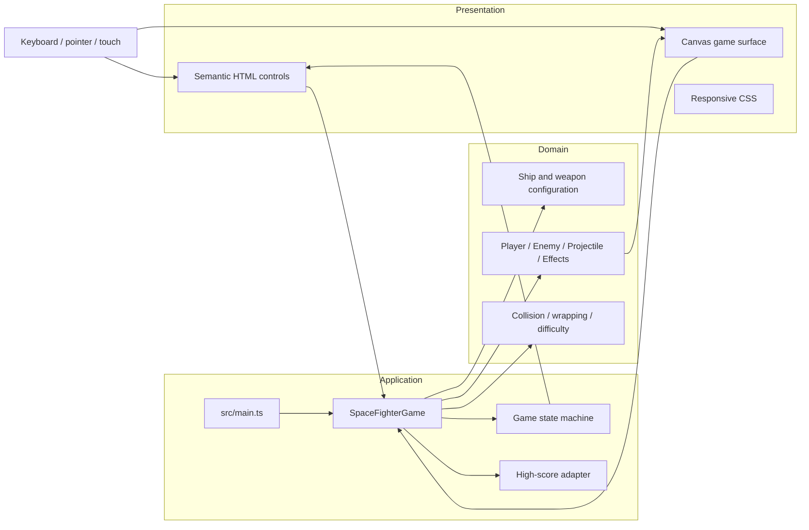
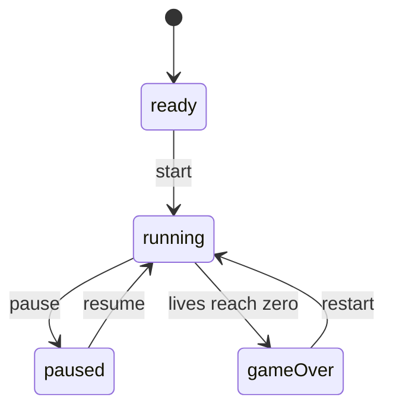
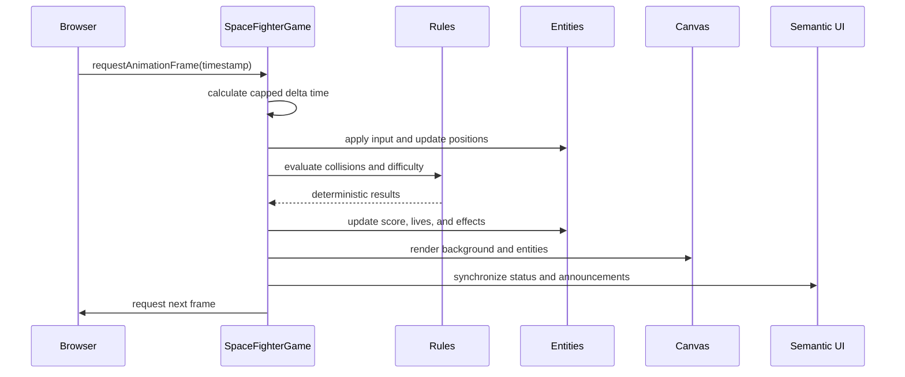
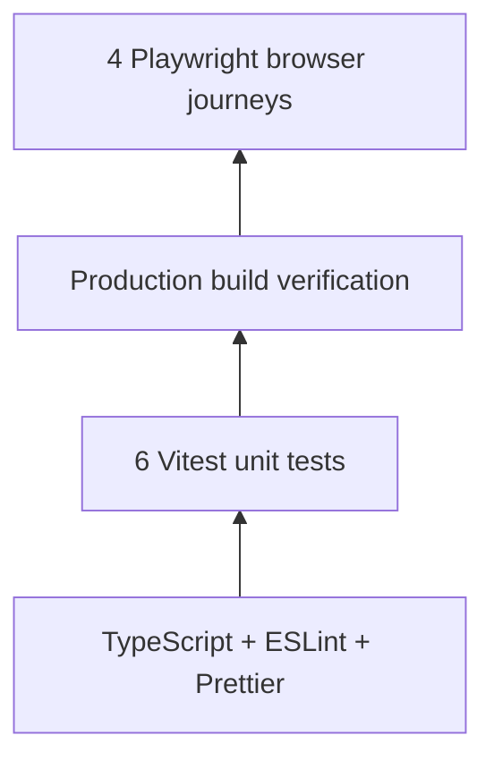

# Space Fighter

Space Fighter is a responsive browser game engineered with TypeScript, Canvas 2D, and Vite. It demonstrates how a small interactive product can still use deliberate architecture, testable domain logic, accessible controls, automated quality gates, and a production-ready delivery workflow.

The application runs without a game engine or runtime framework. Its gameplay loop, state transitions, entity behavior, input handling, collision rules, procedural rendering, and persistence boundary are implemented directly in TypeScript.

## Play online

[**Launch Space Fighter →**](https://space-fighter-sand.vercel.app/)

Open the game in a desktop or mobile browser to play it directly—no installation required.

## Engineering highlights

- Frame-rate-independent gameplay driven by `requestAnimationFrame` and delta time
- Explicit ready, running, paused, and game-over state transitions
- Modular boundaries between orchestration, entities, configuration, rules, and presentation
- Keyboard, mouse, and touch input through a shared game controller
- Data-driven ships and weapons with different movement and firing behavior
- Procedural Canvas graphics with zero production dependencies
- Semantic HTML controls, focus management, live announcements, and responsive layout
- Local high-score persistence with a failure-safe storage boundary
- Ten automated tests: six unit tests and four Playwright end-to-end journeys
- Continuous integration for types, linting, formatting, unit tests, build verification, and browser tests

## Technology

| Area               | Technology                   | Responsibility                                       |
| ------------------ | ---------------------------- | ---------------------------------------------------- |
| Language           | TypeScript                   | Strict types for application and gameplay contracts  |
| Rendering          | Canvas 2D                    | Real-time procedural game graphics                   |
| Build tooling      | Vite                         | Development server and optimized production bundle   |
| Unit testing       | Vitest                       | Fast validation of deterministic game rules          |
| End-to-end testing | Playwright                   | User journeys in an isolated Chromium browser        |
| Code quality       | ESLint and Prettier          | Static analysis and consistent formatting            |
| Automation         | GitHub Actions               | Repeatable quality gates on every main-branch update |
| Deployment         | Vercel-compatible static app | CDN-ready build with security headers                |

## System architecture

The design follows a **functional-core, imperative-shell** approach. Browser APIs and mutable frame orchestration stay in the outer controller, while deterministic gameplay calculations remain pure and independently testable.



### Component responsibilities

| Component               | Role                                                                                        |
| ----------------------- | ------------------------------------------------------------------------------------------- |
| `src/main.ts`           | Composition root that resolves DOM elements and constructs the application                  |
| `SpaceFighterGame.ts`   | Controller for state, input, timing, entity coordination, rendering, and UI synchronization |
| `config.ts`             | Typed, declarative ship, weapon, and game-balancing configuration                           |
| `entities.ts`           | Behavior and procedural drawing for players, enemies, projectiles, explosions, and feedback |
| `rules.ts`              | Pure collision, wrapping, and difficulty calculations                                       |
| `style.css`             | Responsive presentation, interaction states, and reduced-motion behavior                    |
| `rules.test.ts`         | Unit-level verification of deterministic domain behavior                                    |
| `space-fighter.spec.ts` | Browser-level verification of critical user journeys and responsive behavior                |

## Architectural and design patterns

### Application Controller

`SpaceFighterGame` acts as the application controller and facade for the browser layer. It owns the lifecycle of a game session and coordinates entities, input, rendering, storage, and semantic status updates without leaking those responsibilities into the bootstrap file.

### Finite State Machine

The game lifecycle is represented by a constrained `GameStatus` union:



Actions are guarded by the current state, which prevents invalid transitions such as pausing before a game starts or resuming after game over.

### Dependency Injection

The controller receives its required DOM elements through its constructor. This keeps element discovery inside the composition root, makes dependencies explicit, and prevents hidden document queries throughout the game logic.

### Data-Driven Strategy

Ships and weapons are modeled as typed configuration rather than duplicated conditional branches. Selecting a configuration changes movement speed, firing cadence, projectile spread, appearance, and scoring behavior while the orchestration algorithm remains unchanged.

### Entity Model

Each moving or visual object encapsulates its own update and drawing behavior. The controller manages collections and interactions, while individual entities remain responsible for their local state.

### Functional Core, Imperative Shell

Collision detection, position wrapping, and difficulty progression are pure functions in `rules.ts`. Browser events, animation frames, Canvas commands, and local storage remain in the imperative shell. This boundary makes core rules deterministic, fast to test, and independent of the DOM.

### Observer-Style Event Handling

DOM keyboard, pointer, visibility, and button events feed a normalized input state. The frame loop consumes that state instead of embedding gameplay calculations directly inside individual event callbacks.

### Resilient Boundary Adapter

High-score persistence is isolated behind small read/write methods. Storage failures are contained so privacy settings or unavailable browser storage cannot make the game unplayable.

## Runtime flow



The delta is capped before each update to prevent a large movement jump after a suspended or backgrounded browser tab.

## Testing strategy

The project uses layered tests so each risk is checked at the fastest reliable level.



### Unit tests

Vitest exercises the pure domain layer without starting a browser:

- Collision at and beyond the combined-radius boundary
- Player wrapping beyond the left and right edges
- Preservation of valid on-screen positions
- Difficulty progression from its baseline through its upper cap

These tests are intentionally small and deterministic, making rule regressions quick to identify.

### End-to-end tests

Playwright starts the application and verifies it through the same accessible controls a user operates.

| Journey                | Risk covered                                                                |
| ---------------------- | --------------------------------------------------------------------------- |
| Accessible ready state | Page boot, headings, Canvas labeling, initial score/lives, disabled actions |
| Configure and play     | Ship and weapon selection, start, pause, resume, and keyboard interaction   |
| High-score restoration | Browser storage integration and UI synchronization                          |
| Mobile viewport        | Critical controls remain visible with no horizontal overflow at 390px       |

Tests use role-, label-, and state-based locators instead of visual coordinates. This verifies semantic behavior and makes the suite less brittle when presentation styles change.

### Continuous integration

```mermaid
flowchart LR
    Change[Push or pull request] --> Install[npm ci]
    Install --> Browser[Install isolated Chromium]
    Browser --> Types[Type check]
    Types --> Lint[Lint and format check]
    Lint --> Unit[Unit tests]
    Unit --> Build[Production build]
    Build --> E2E[End-to-end tests]
    E2E --> Report[Playwright report artifact]
```



GitHub Actions runs the complete pipeline in a clean Linux environment. Playwright traces are retained on retries, and an HTML browser-test report is uploaded for inspection.

## Quality attributes

- **Correctness:** strict TypeScript, pure rule tests, and state-based end-to-end assertions
- **Performance:** delta-time updates, bounded frame deltas, procedural assets, and a small production bundle
- **Accessibility:** semantic controls, keyboard operation, focus management, Canvas fallback content, and live status announcements
- **Responsiveness:** scalable Canvas presentation and mobile-specific layout verification
- **Reliability:** safe input reset on focus loss, automatic pause on hidden tabs, and storage failure handling
- **Security:** no production dependencies, restrictive deployment headers, and no external runtime assets
- **Maintainability:** typed configuration, explicit responsibilities, pure rule boundaries, and automated formatting

## Engineering trade-offs

- **Canvas instead of DOM entities:** Canvas is suited to frequent rendering and many moving objects, while surrounding controls remain semantic HTML for accessibility.
- **No game engine:** implementing the loop and rules directly keeps the architecture visible and the bundle small, at the cost of building collision and lifecycle infrastructure manually.
- **Procedural graphics:** generated shapes eliminate asset-loading failures and licensing ambiguity, while intentionally favoring a cohesive minimal style over detailed artwork.
- **Local storage:** it provides instant persistence without a backend, but scores remain device-local and are not authoritative multiplayer data.
- **Configuration over subclasses:** typed data keeps ship and weapon variants easy to extend; more complex future behavior could graduate to dedicated strategy objects.

## Project structure

```text
.
├── .github/workflows/ci.yml    # Complete CI quality pipeline
├── e2e/
│   └── space-fighter.spec.ts   # Playwright user journeys
├── public/
│   └── favicon.svg             # Procedural project identity
├── src/
│   ├── game/
│   │   ├── SpaceFighterGame.ts # State, input, frame loop, and orchestration
│   │   ├── config.ts           # Typed ship and weapon configuration
│   │   ├── entities.ts         # Entity behavior and procedural rendering
│   │   ├── rules.ts            # Pure gameplay calculations
│   │   └── rules.test.ts       # Vitest unit tests
│   ├── main.ts                 # Composition root
│   └── style.css               # Responsive presentation
├── index.html                  # Semantic application shell
├── playwright.config.ts        # End-to-end test environment
└── vercel.json                 # Deployment and security headers
```

## Local development

Prerequisites: Node.js 20.19 or newer and npm.

```bash
git clone https://github.com/deepthi132/Space_Fighter.git
cd space_fighter
npm ci
npm run dev
```

## Running the quality pipeline

Install the isolated Playwright browser once:

```bash
npx playwright install chromium
```

Then run every local quality gate:

```bash
npm run check:all
```

Individual commands are also available:

```bash
npm run typecheck
npm run lint
npm run format
npm run test:unit
npm run test:e2e
npm run build
```

## Controls

| Action          | Keyboard              | Pointer or touch                |
| --------------- | --------------------- | ------------------------------- |
| Move            | Left and Right arrows | Drag across the game area       |
| Fire            | Space                 | Press and hold on the game area |
| Switch weapon   | 1, 2, or 3            | Select a weapon button          |
| Pause or resume | P or Escape           | Pause button                    |

Three enemy escapes end a run. Enemy speed increases with score, while ship and weapon choices change movement speed, firing cadence, projectile patterns, and points per hit.

## Roadmap

- Add automated accessibility scanning and visual-regression baselines
- Introduce deterministic seeded gameplay for deeper simulation testing
- Add sound effects with a persistent mute preference
- Add boss encounters, collectible power-ups, and difficulty modes
- Extract complex enemy movement into interchangeable behavior strategies

## Credits

Designed and developed by Deepthi Ramneti. The architecture, interface, gameplay systems, test suites, and delivery workflow are implemented as a modular TypeScript browser application. All graphics are rendered procedurally with Canvas 2D.
