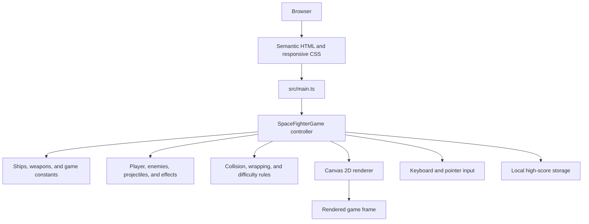

# Space Fighter

Space Fighter is a responsive browser game built with TypeScript, Canvas 2D, and Vite. The project explores real-time rendering, input handling, collision detection, state transitions, and accessible web controls without relying on a game engine or runtime framework.

The game is implemented as a browser-native application with frame-rate-independent movement, keyboard and pointer controls, multiple ships and weapons, progressive difficulty, high-score persistence, and a complete start-to-game-over loop.

## What the project demonstrates

- A request-animation-frame game loop with delta-time updates
- Separation between game configuration, entities, rules, orchestration, and presentation
- Procedural Canvas rendering with no runtime image dependencies
- Keyboard, mouse, and touch input through a unified controller
- Explicit ready, running, paused, and game-over states
- Responsive UI and accessible HTML controls around an interactive canvas
- Automated type checking, linting, formatting, tests, builds, and CI

## Technology

- TypeScript
- HTML5 Canvas 2D
- Vite
- Vitest
- ESLint and Prettier
- GitHub Actions
- Vercel-compatible static deployment

## System architecture



`SpaceFighterGame` owns the application state and coordinates the frame lifecycle. Entity classes contain movement and drawing behavior, while `rules.ts` keeps deterministic game calculations independent from the browser so they can be unit tested.

### Frame lifecycle

1. `requestAnimationFrame` supplies a timestamp.
2. The controller converts elapsed time into a capped delta value.
3. Input updates the player and firing state.
4. Entities move according to elapsed time rather than display refresh rate.
5. Collision and escape rules update score, lives, difficulty, and effects.
6. The renderer draws the background, entities, projectiles, and feedback layers.
7. HTML status controls stay synchronized with the game state.

## Project structure

```text
.
├── .github/workflows/ci.yml   # Automated quality checks
├── public/favicon.svg         # Project favicon
├── src/
│   ├── game/
│   │   ├── SpaceFighterGame.ts # State, input, frame loop, and orchestration
│   │   ├── config.ts           # Typed ship and weapon configuration
│   │   ├── entities.ts         # Game entities and procedural rendering
│   │   ├── rules.ts            # Pure gameplay calculations
│   │   └── rules.test.ts       # Unit tests for deterministic rules
│   ├── main.ts                 # DOM bootstrap
│   └── style.css               # Responsive application styling
├── index.html                  # Semantic game interface
└── vercel.json                 # Static deployment and security headers
```

## Local setup

Prerequisites: Node.js 20.19 or newer and npm.

```bash
git clone https://github.com/deepthi132/space_fighter.git
cd space_fighter
npm ci
npm run dev
```

Create a production build with:

```bash
npm run build
npm run preview
```

## Controls

| Action          | Keyboard              | Pointer or touch                |
| --------------- | --------------------- | ------------------------------- |
| Move            | Left and Right arrows | Drag across the game area       |
| Fire            | Space                 | Press and hold on the game area |
| Switch weapon   | 1, 2, or 3            | Select a weapon button          |
| Pause or resume | P or Escape           | Pause button                    |

Three enemy escapes end a run. Enemy speed increases with score, while ship and weapon choices change movement speed, firing cadence, projectile patterns, and points per hit.

## Quality checks

```bash
npm run typecheck
npm run lint
npm run format
npm run test
npm run build
```

Run the full local verification pipeline with `npm run check`. The same pipeline runs for every pull request through GitHub Actions.

## Engineering decisions

- **Delta-time movement:** gameplay speed remains consistent across different refresh rates.
- **Procedural artwork:** Canvas paths keep the project self-contained and avoid external asset-loading failures.
- **Pure rules:** collision, wrapping, and difficulty logic can be tested without a browser.
- **Input isolation:** game shortcuts ignore interactive HTML controls and reset safely when focus is lost.
- **Progressive enhancement:** the canvas includes fallback content, while status and configuration remain semantic HTML.
- **Zero production dependencies:** tooling is used only during development and compilation.

## Credits

Designed and developed by Deepthi Ramneti. The current architecture, interface, and gameplay systems form a modular TypeScript browser game, with all graphics rendered procedurally through Canvas 2D.

## Roadmap

- Add sound effects and a persistent mute preference
- Introduce boss encounters and collectible power-ups
- Expand automated browser and accessibility coverage
- Add optional difficulty modes and saved player preferences
